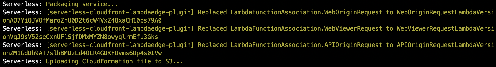
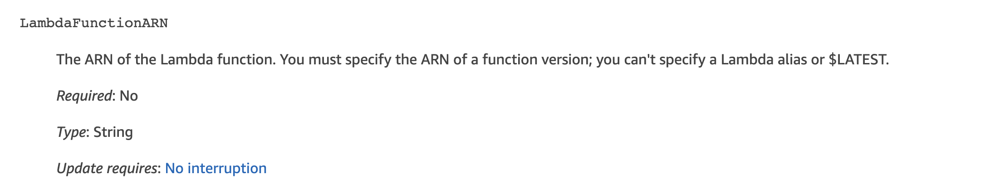
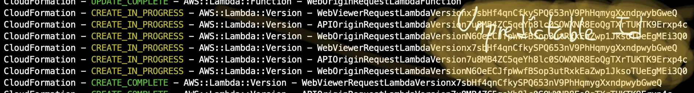

# serverless-cloudfront-lambdaedge-plugin

A serverless plugin that injects actual Lambda Version ARN to LambdaAssociations in CloudFront CFN resource



## Why?






[Lambda@Edge replicates function to all CloudFront Edges.](https://docs.aws.amazon.com/AmazonCloudFront/latest/DeveloperGuide/lambda-edge-how-it-works.html)

Due to this behavior, Lambda@Edge configuration requires Full Lambda Function ARN.
You cannot reference alias or `$LATEST` tag when configuring Lambda@Edge.

[You **MUST** reference fully-qualified Lambda Function version ARN.](https://docs.aws.amazon.com/AWSCloudFormation/latest/UserGuide/aws-properties-cloudfront-distribution-lambdafunctionassociation.html)

Currently there's no easy/reliable way to setup Lambda@Edge using Serverless Framework.

Recently released Serverless framework added support of Lambda@Edge triggers, [but it looks not easily customizable](https://github.com/serverless/serverless/issues/6785).
so you will have to use CloudFormation Template to configure Lambda@Edge.

[Unfortunately, Serverless framework creates a new Lambda Version in every deployment with unpredictable hash suffix](https://github.com/serverless/serverless/blob/5fa10f59279d0b8c2e31c9ab5c3121fc06b32813/lib/plugins/aws/package/compile/functions/index.js#L478-L551), and it's by default.
You cannot reference Lambda Function version resource directly in your CloudFormation template.

This plugin replaces all `LambdaFunctionAssociations` in your `serverless.yml` CloudFormation template to automatically created Lambda Version references.   


## Install

First, install package as development dependency.

```bash
$ npm i serverless-cloudfront-lambdaedge-plugin --save-dev
```

Then, add the plugin to `serverless.yml`

```yaml
# serverless.yml

plugins:
  - serverless-cloudfront-lambdaedge-version
```

## Setup

Just specify `LambdaFunctionARN` of LambdaFunctionAssociations to matching function name.

Let's suppose that you've defined functions in `serverless.yml` like below:

```yaml
functions:
  APIOriginRequest:
    name: ${self:service}-${self:provider.stage}-api-origin-request
    handler: handlers/api/origin-request.handler
    memorySize: 128
    timeout: 5
    role: LambdaEdgeExecutionRole
  WebOriginRequest:
    name: ${self:service}-${self:provider.stage}-web-origin-request
    handler: handlers/api/origin-request.handler
    memorySize: 128
    timeout: 5
    role: LambdaEdgeExecutionRole
```

Just Specify `LambdaFunctionARN` block like below:

```yaml
resources:
  Resources:
    CloudFrontDistribution:
      Type: AWS::CloudFront::Distribution
      Properties:
        DistributionConfig:
          # ... TRUNCATED ...
          DefaultCacheBehavior:
            LambdaFunctionAssociations:
              - EventType: origin-request
                LambdaFunctionARN: WebOriginRequest # Specify matching function name
            # ... TRUNCATED ...
          CacheBehaviors:
            - PathPattern: "/api/*"
              LambdaFunctionAssociations:
                - EventType: origin-request
                  LambdaFunctionARN: APIOriginRequest # Specify matching function name
              # ... TRUNCATED ...
          # ... TRUNCATED ...
```
 
and then, deploy your stack. 
This plugin will automatically replace `LambdaFunctionARN` block to `{ Ref: "MatchingLambdaVersionLogicalId" }`.

## Changelog

See [CHANGELOG](CHANGELOG.md).


## License
[MIT](LICENSE)

See full license on [mooyoul.mit-license.org](http://mooyoul.mit-license.org/)
